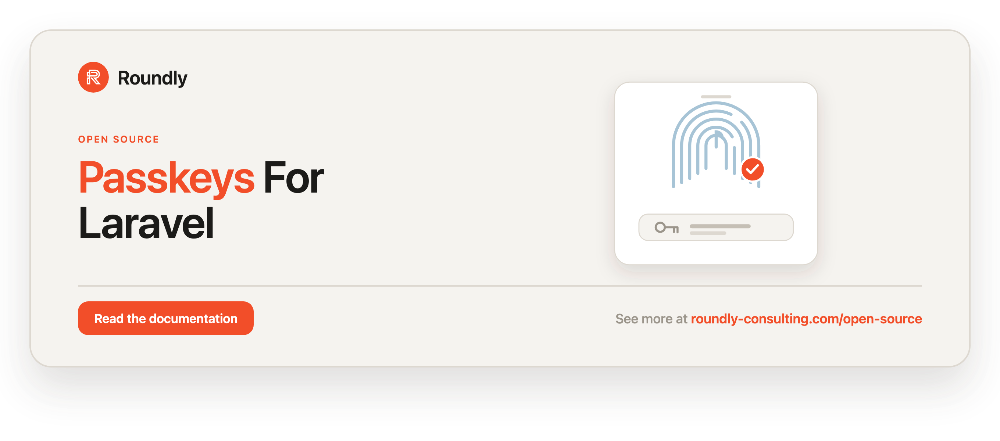

<!-- roundly-hero:start -->
<p align="center">
  <a href="https://roundly-consulting.com/open-source/docs/passkeys-for-laravel?utm_source=github&utm_medium=readme&utm_campaign=open-source&utm_content=passkeys-for-laravel">
    
  </a>
</p>
<!-- roundly-hero:end -->

<!-- roundly-badges:start -->
<p align="center">
  <a href="https://packagist.org/packages/roundly-consulting/passkeys-for-laravel"></a>
  <a href="https://github.com/roundly-consulting/passkeys-for-laravel/actions/workflows/run-tests.yml"></a>
  <a href="https://github.com/roundly-consulting/passkeys-for-laravel/actions/workflows/fix-php-code-style-issues.yml"></a>
  <a href="https://donate.stripe.com/dRmeVe8FX5PF1Qd9pXcEw00"></a>
  <a href="https://www.patreon.com/cw/roundly"></a>
  <a href="https://roundly-consulting.com/support-us?utm_source=github&utm_medium=readme&utm_campaign=open-source&utm_content=passkeys-for-laravel#crypto"></a>
</p>
<!-- roundly-badges:end -->

# Passkeys for Laravel

A native **WebAuthn / FIDO2 passkey relying party** for Laravel — register and authenticate
passkeys with **no third-party crypto dependencies**. The registration and authentication
ceremonies follow the [WebAuthn Level 2](https://www.w3.org/TR/webauthn-2/) specification, and
ES256 / RS256 / EdDSA credentials are all supported.

The package is deliberately **controller-less**: it ships actions, DTOs, a model, a challenge
store, and events, so your application wires its own HTTP endpoints (stateless or session-based)
on top.

## Integrates with

- **[crypto-for-laravel](https://github.com/roundly-consulting/crypto-for-laravel)** — the
  cryptography this relying party runs on: CBOR/COSE decoding, COSE key parsing, ECDSA DER↔raw
  conversion, RSA/ECDSA/Ed25519 signature verification, base64url, SHA-256 and constant-time
  comparison. It is a hard dependency, installed automatically; there is nothing to configure.
  Passkeys keeps what is genuinely its own — the **ceremony**: challenge binding, origin and RP ID
  validation, user-presence/verification policy, sign-counter reconciliation, and attestation
  trust.
- **[enums-for-laravel](https://github.com/roundly-consulting/enums-for-laravel)** — the shared
  enum helpers (`values()`, `options()`, …) on this package's enums.

## Requirements

- PHP 8.4+
- Laravel 12 or 13
- `ext-json`
- `ext-sodium` (optional — only for Ed25519 / EdDSA verification)

## Installation

```bash
composer require roundly-consulting/passkeys-for-laravel
```

Publish and run the migrations — the package never loads them for you, so publishing is not
optional:

```bash
php artisan vendor:publish --tag="passkeys-migrations"
php artisan migrate
```

Optionally publish the config file:

```bash
php artisan vendor:publish --tag="passkeys-config"
```

Optionally publish the translation lines:

```bash
php artisan vendor:publish --tag="passkeys-translations"
```

## Configuration

`config/passkeys.php` documents every option. The security-critical values are `rp.id` and
`origins` — they **cannot be safely defaulted** and must be set for a ceremony to run.

| Key | Env | Default | Purpose |
|---|---|---|---|
| `rp.id` | `PASSKEYS_RP_ID` | host of `app.url` | Relying Party ID; a registrable-domain suffix of the origin (e.g. `example.com`). |
| `rp.name` | `PASSKEYS_RP_NAME` | `APP_NAME` | Human-readable RP name shown by the authenticator. |
| `origins` | `PASSKEYS_ORIGINS` | `[]` | Comma-separated allow-list of acceptable `clientData.origin` values. |
| `allow_cross_origin` | `PASSKEYS_ALLOW_CROSS_ORIGIN` | `false` | Whether a cross-origin (iframe) ceremony is accepted. |
| `algorithms` | — | `ES256`, `RS256` | COSE algorithms offered/accepted, in preference order. |
| `timeout_ms` | `PASSKEYS_TIMEOUT_MS` | `60000` | Ceremony timeout hint sent to the browser. |
| `attestation` | `PASSKEYS_ATTESTATION` | `none` | Attestation conveyance preference (`none`/`indirect`/`direct`). |
| `user_verification` | — | `required` | UV requirement (`required`/`preferred`/`discouraged`). |
| `resident_key` | `PASSKEYS_RESIDENT_KEY` | `required` | Discoverable-credential posture (`required`/`preferred`/`discouraged`); `required` keeps usernameless login. |
| `challenge.store` | `PASSKEYS_CHALLENGE_STORE` | default cache store | Cache store name for challenges. |
| `challenge.ttl` | `PASSKEYS_CHALLENGE_TTL` | `60` | Minimum challenge lifetime in seconds; a challenge always lives at least as long as its ceremony's timeout (config or per-call). |
| `challenge.bytes` | — | `32` | Random challenge length in bytes. |
| `sign_count_policy` | — | `flag` | Counter-regression handling: `reject` throws, `flag` fires an event and proceeds. |
| `attestation_trust` | `PASSKEYS_ATTESTATION_TRUST` | `ignore` | Trust policy for the attestation statement: `ignore` / `self` / `basic` (see **Attestation**). |
| `reject_unknown_fmt` | `PASSKEYS_REJECT_UNKNOWN_FMT` | `false` | Under `ignore`, refuse a format we cannot verify — and a known format whose statement does not verify. |
| `attestation_anchors.defaults` | `PASSKEYS_ATTESTATION_DEFAULT_ANCHORS` | `true` | Trust the roots shipped in `resources/roots/` (Apple WebAuthn Root CA for the `apple` format, Google hardware-attestation roots for the not-yet-verified `android-key` format). |
| `attestation_anchors.paths` | — | `[]` | `format => [absolute PEM paths]` — your own trust anchors. |
| `attestation_clock_skew` | `PASSKEYS_ATTESTATION_CLOCK_SKEW` | `60` | Leeway (seconds, 0–3600) on both bounds of an attestation certificate's validity window. |
| `aaguids.allowed` | `PASSKEYS_AAGUIDS_ALLOWED` | `[]` | Comma-separated AAGUID allow-list; empty allows every authenticator model. |
| `user.handle_column` | `PASSKEYS_USER_HANDLE_COLUMN` | `passkey_user_handle` | Host column holding the opaque user handle. |
| `user.name_attribute` | — | `email` | Model attribute used as the account name. |
| `user.display_name_attribute` | — | `name` | Model attribute used as the display name. |
| `user.handle_bytes` | — | `32` | Length of the generated opaque user handle, in bytes. |
| `model` | — | `Passkey::class` | The credential model. Point it at a subclass of `Passkey` to add behaviour; every ceremony resolves it. |
| `table` | — | `passkeys` | The credential table. Publish the config **before** migrating if you rename it — the migration reads this key. |

## Using your own credential model

Point `passkeys.model` at a subclass of `RoundlyConsulting\Passkeys\Models\Passkey`. The package
resolves the configured class everywhere — the `passkeys()` relation, both ceremonies, and the
factory — so registration hands your class back and its model events fire:

```php
// config/passkeys.php
'model' => App\Models\Credential::class,
```

## Preparing your user model

Implement the `HasPasskeys` contract via the `InteractsWithPasskeys` concern, and add a nullable,
unique column for the opaque, non-PII user handle (generated lazily on first registration). The
`passkeyUserHandle()` Blueprint macro creates it on any account table, named after
`passkeys.user.handle_column`:

```php
// database/migrations/xxxx_add_passkey_user_handle_to_users_table.php
Schema::table('users', function (Blueprint $table): void {
    $table->passkeyUserHandle();   // string(passkeys.user.handle_column)->nullable()->unique()
});
```

```php
use Illuminate\Foundation\Auth\User as Authenticatable;
use RoundlyConsulting\Passkeys\Concerns\InteractsWithPasskeys;
use RoundlyConsulting\Passkeys\Contracts\HasPasskeys;

final class User extends Authenticatable implements HasPasskeys
{
    use InteractsWithPasskeys;
}
```

The account name and display name default to the model's `email` and `name` attributes; override
the methods or repoint them via config.

The user handle is generated **lazily** and persisted on the first call to
`registrationOptions()`/`authenticationOptions($user)` — a small write on an otherwise read-shaped
call. The value is random, non-PII, and stable once set, so a rare double-write under concurrent
first-time requests is harmless (last write wins). If you prefer to avoid the lazy write entirely
(e.g. under heavy concurrency), generate the handle eagerly when the user is created:

```php
use Illuminate\Support\Str;

// e.g. in a User creating() observer
$user->passkey_user_handle ??= Str::random(43); // 32 random bytes, base64url
```

## Usage

The `Passkeys` facade is the single entry point. Everything scoped to one account goes through
`Passkeys::for($user)`; the discoverable (usernameless) login stays flat because there is no
account yet. Each ceremony is two calls: generate options for the browser, then verify the
browser's response.

```php
use RoundlyConsulting\Passkeys\Facades\Passkeys;

$keys = Passkeys::for($user);

$keys->registrationOptions(?$overrides);        // CreationOptionsData
$keys->register($response, name: 'Laptop');     // Passkey
$keys->authenticationOptions(?$overrides);      // RequestOptionsData bound to this account
$keys->authenticate($response);                 // Passkey — only this account's credential
$keys->all();                                   // Collection<Passkey>, newest first
$keys->find($id);                               // ?Passkey — null for another account's id
$keys->count();                                 // int
$keys->exists();                                // bool
$keys->rename($passkeyOrId, 'Work laptop');     // Passkey — refuses another account's passkey
$keys->revoke($passkeyOrId);                    // void — refuses another account's passkey

Passkeys::authenticationOptions(?$overrides);   // discoverable (usernameless) login
Passkeys::authenticate($response, ?$expect);    // → Passkey; $expect holds it to an owner (type)
Passkeys::attestationFormats();                 // ['none', 'packed', 'apple']
```

### Registration

```php
use RoundlyConsulting\Passkeys\Facades\Passkeys;
use RoundlyConsulting\Passkeys\DataTransferObjects\RegistrationResponseData;

// 1. Server -> client: creation options (also stores a single-use challenge).
$options = Passkeys::for($user)->registrationOptions();
return response()->json($options); // feed publicKey to navigator.credentials.create()

// 2. Client -> server: verify the attestation response and persist the credential.
//    Pass an optional friendly name for a "your passkeys" screen.
$passkey = Passkeys::for($user)->register(
    RegistrationResponseData::fromArray($request->validated()),
    name: 'MacBook Touch ID',
);
```

### Authentication

```php
use RoundlyConsulting\Passkeys\Facades\Passkeys;
use RoundlyConsulting\Passkeys\DataTransferObjects\AuthenticationResponseData;

// 1. Server -> client: request options (usernameless — any account's passkey can answer).
$options = Passkeys::authenticationOptions();
return response()->json($options);                 // feed publicKey to navigator.credentials.get()

// 2. Client -> server: verify the assertion; the resolved credential's owner is reachable
//    via $passkey->authenticatable. The host then issues its own session or token.
$passkey = Passkeys::authenticate(
    AuthenticationResponseData::fromArray($request->validated()),
);
$user = $passkey->authenticatable;
```

The `ceremonyId` returned in the options travels back with the response so a stateless host can
correlate the challenge; a session-based host can echo it or store the challenge in the session.

Options minted **for a user** (`Passkeys::for($user)->authenticationOptions()`) are bound to that
user: the ceremony can only be completed with one of the credentials it offered in
`allowCredentials`. Another
account's passkey — or one enrolled after the options were issued — gets the same uniform
`CredentialNotFound` as an unknown credential. Usernameless options stay open to any registered
credential.

### Second factor and owner expectations

After a password, magic-link, or one-time-code login you know the account; ask for **its** passkey
through `Passkeys::for($user)`, which holds the result to that account
(`AuthenticationExpectation::owner($user)`):

```php
use RoundlyConsulting\Passkeys\DataTransferObjects\AuthenticationOptionsOverrides;
use RoundlyConsulting\Passkeys\Enums\UserVerification;

// 1. Options for the known account, demanding user verification for this step only.
$options = Passkeys::for($user)->authenticationOptions(new AuthenticationOptionsOverrides(
    userVerification: UserVerification::Required,
    timeoutMs: 30_000,
));

// 2. Verify, and refuse any credential that is not this exact account's.
$passkey = Passkeys::for($user)->authenticate($response);
```

With several guards whose models all own passkeys, restrict a usernameless login to one owner type:

```php
use RoundlyConsulting\Passkeys\DataTransferObjects\AuthenticationExpectation;

$passkey = Passkeys::authenticate(
    $response,
    AuthenticationExpectation::ownerType((new Client)->getMorphClass()),
);
```

The expectation is checked right after the credential is located — before the challenge is consumed
and before its counter is touched — so a mismatch writes nothing and the right owner can still finish
the same ceremony. A mismatch is the uniform `CredentialNotFound`. `owner()` refuses an unsaved model
(`InvalidExpectation`) rather than silently widening to every account of that type.

`AuthenticationOptionsOverrides` sets `userVerification` and `timeoutMs` for one ceremony; the
requirement is stored with the challenge, so the verifier enforces exactly what the options promised,
and the challenge lives at least as long as the timeout the browser was given.

### Per-call overrides

Tune a single ceremony without changing the global defaults. Beyond user verification,
attestation, and timeout you can opt into a **cross-platform** (roaming security-key) or a
**non-resident** credential:

```php
use RoundlyConsulting\Passkeys\DataTransferObjects\RegistrationOptionsOverrides;
use RoundlyConsulting\Passkeys\Enums\AttestationConveyance;
use RoundlyConsulting\Passkeys\Enums\AuthenticatorAttachment;
use RoundlyConsulting\Passkeys\Enums\ResidentKey;
use RoundlyConsulting\Passkeys\Enums\UserVerification;

$options = Passkeys::for($user)->registrationOptions(new RegistrationOptionsOverrides(
    userVerification: UserVerification::Preferred,
    attestation: AttestationConveyance::Direct,
    timeoutMs: 30_000,
    residentKey: ResidentKey::Discouraged,
    authenticatorAttachment: AuthenticatorAttachment::CrossPlatform,
));
```

The default posture stays `residentKey: required` (usernameless), and `authenticatorSelection`
serialises byte-identically when no override is given.

### Ed25519 (EdDSA) opt-in

Ed25519 (COSE `-8`) verification is fully implemented; it is simply not offered by default
because it needs `ext-sodium`. Once that extension is installed on every host that verifies these
credentials, add it to `config/passkeys.php`:

```php
use RoundlyConsulting\Crypto\Cose\CoseAlgorithm;

'algorithms' => [
    CoseAlgorithm::ES256->value,   // -7
    CoseAlgorithm::RS256->value,   // -257
    CoseAlgorithm::EdDSA->value,   // -8 (requires ext-sodium)
],
```

The COSE registry comes from `crypto-for-laravel`. This relying party accepts **only** ES256,
RS256 and EdDSA (`PasskeyConfig::SUPPORTED_ALGORITHMS`) — configuring any other identifier throws
`InvalidConfiguration` at boot rather than offering an algorithm the ceremony has not been vetted
against.

### Managing credentials

List, rename or revoke an account's passkeys through its handle — no need to touch the model or
the relation. `rename()` and `revoke()` take a `Passkey` or its id, and refuse a passkey of any
other account (or an already revoked one) with the uniform `CredentialNotFound`, so a route
parameter can be passed straight through. A revoked credential is soft-deleted: it can no longer
authenticate, and its credential id still cannot be re-registered.

```php
$keys = Passkeys::for($request->user());

$keys->all();                                    // newest first
$keys->find($id);                                // null when it is not this account's
$keys->count();
$keys->exists();

$keys->rename($request->route('passkey'), 'Work laptop'); // fires PasskeyRenamed
$keys->revoke($request->route('passkey'));                // soft-deletes, fires PasskeyRevoked
```

Query one owner's credentials from any other context with the `ownedBy` scope:

```php
Passkey::query()->ownedBy($user)->latest('last_used_at')->get();
```

### Listing credentials safely

The `Passkey` model hides `public_key`, `user_handle`, and the credential-id lookup keys from
array/JSON serialisation. Use the shipped `PasskeyResource` for an explicit, display-safe payload:

```php
use RoundlyConsulting\Passkeys\Http\Resources\PasskeyResource;

return PasskeyResource::collection(Passkeys::for($user)->all());
// [{ id, name, aaguid, transports, backup_eligible, backup_state, last_used_at, created_at }]
```

### User-model verbs

The `InteractsWithPasskeys` concern also exposes ceremony verbs so the user model is the subject.
Each delegates to `Passkeys::for($this)`, so `Passkeys::fake()` sees it:

```php
$options = $user->passkeyRegistrationOptions();               // ->registrationOptions()
$passkey = $user->registerPasskey($response, 'MacBook Touch ID'); // ->register()
$options = $user->passkeyAuthenticationOptions($overrides);   // ->authenticationOptions()

$user->hasPasskeys();   // ->exists() — at least one active (non-revoked) passkey
$user->passkeyCount();  // ->count()
```

### Without the facade

The facade root is the `PasskeyService` contract (implemented by `PasskeyManager`). Inject it for
the same API — `Passkeys::fake()` swaps this binding too:

```php
use RoundlyConsulting\Passkeys\Contracts\PasskeyService;

final readonly class RevokePasskeyController
{
    public function __construct(private PasskeyService $passkeys) {}

    public function __invoke(Request $request, int $passkey): Response
    {
        $this->passkeys->for($request->user())->revoke($passkey);

        return response()->noContent();
    }
}
```

Or run a use case's action directly — each call is one action, resolved from the container:

| Call | Action |
|---|---|
| `for($user)->registrationOptions($o)` | `GenerateRegistrationOptionsAction::execute($user, $o)` |
| `for($user)->register($r, $name)` | `VerifyRegistrationAction::execute($user, $r, $name)` |
| `for($user)->authenticationOptions($o)` / `authenticationOptions($o)` | `GenerateAuthenticationOptionsAction::execute(?$user, $o)` |
| `for($user)->authenticate($r)` / `authenticate($r, $expect)` | `VerifyAuthenticationAction::execute($r, ?$expect)` |
| `for($user)->rename($p, $name)` | `RenamePasskeyAction::execute($passkey, $name)` — **unscoped** |
| `for($user)->revoke($p)` | `RevokePasskeyAction::execute($passkey)` — **unscoped** |

The rename/revoke actions take a resolved `Passkey` and check no ownership — the handle does that.
Call them directly only from trusted code (an admin tool, a job that already scoped its query).

## Attestation

Attestation is how an authenticator proves **what it is**. It is off by default (the format is
recorded, the statement is never read), and turning it on is **two config lines**:

```dotenv
PASSKEYS_ATTESTATION=direct        # ask authenticators to attest
PASSKEYS_ATTESTATION_TRUST=basic   # and refuse anything unproven
```

Ceremony call sites do not change at all — attestation hardening is configuration, not code.

> ⚠️ **Synced passkeys never attest.** iCloud Keychain, Google Password Manager and most password
> managers answer even a `direct` request with `fmt: none` (their AAGUID names the provider, e.g.
> iCloud Keychain, never a device), because a key that moves between devices has no single device to
> vouch for. Under `self` or
> `basic` every such passkey is refused with `AttestationRequired` — in practice that is **every
> passkey an unmanaged iPhone, iPad or Mac creates today**. The strict tiers are for fleets of
> device-bound authenticators (security keys, managed devices); keep `ignore` (the default) for
> consumer sign-in.

What changes is what you can see afterwards:

```php
$passkey->attestation_format;   // 'packed' | 'apple' | 'none'
$passkey->attestation_type;     // 'basic' | 'anonca' | 'self' | 'none' — the grade of proof established
```

### The trust ladder

| `attestation_trust` | What it accepts |
|---|---|
| `ignore` (default) | Everything. The format is recorded; **no statement is ever read**. |
| `self` | The statement's **maths must hold** — signature, chain linkage, certificate validity dates. Anchoring is waived, so self-attestation and an un-anchored batch certificate both pass. A `none` statement — every synced passkey — is refused. |
| `basic` | The maths must hold **and** the certificate chain must reach a configured **trust anchor**. Self-attestation is refused. |

Supported formats:

| `fmt` | Who sends it | Attestation type established |
|---|---|---|
| `none` | Everything unless you ask for `direct` — and **synced passkeys always** (iCloud Keychain, Google Password Manager, most password managers) | `none` |
| `packed` | CTAP2 security keys; MDM-managed Apple devices with Apple's Passkey Attestation configuration | `basic` (x5c) or `self` (no x5c) |
| `apple` | Older **device-bound** Touch ID / Face ID credentials (from before passkeys synced through iCloud Keychain — iOS 16 / macOS 13). Synced iCloud Keychain passkeys send `none`. | `anonca` |

An authenticator presenting anything else under `self`/`basic` is refused by name
(`UnsupportedAttestationFormat`).

**Apple attests anonymously.** Its statement carries no signature over the ceremony at all: the
credential certificate instead carries a nonce equal to `SHA-256(authenticatorData ‖
clientDataHash)`, and certifies the credential's own public key. Both are verified, which is what
makes a statement from another ceremony unusable here. The grade it establishes is `anonca` —
"a genuine Apple authenticator", never a device identity, which is exactly what Apple intends.

### Trust anchors

A chain is anchored when its last certificate **is** an anchor, or is **signed by** one (x5c
commonly omits the root). Security keys attest under their vendor's own root, so supply it:

```php
'attestation_anchors' => [
    'paths' => ['packed' => [storage_path('webauthn/vendor-fido-ca.pem')]],
],
```

The package ships **Apple's published WebAuthn Root CA** and **Google's published
hardware-attestation roots** in `resources/roots/` (trusted unless
`PASSKEYS_ATTESTATION_DEFAULT_ANCHORS=false`); every fingerprint is pinned in the test suite. An
`apple`-format statement therefore anchors under `basic` with no setup — Apple omits the root from
its `x5c`, and the shipped anchor completes the chain. That covers only the older device-bound
credentials above: synced iCloud Keychain passkeys carry no statement at all (see the warning under
[Attestation](#attestation)). The Google roots are for the `android-key` format, which is not
verified yet (it is refused under `self`/`basic` as an unsupported format).

**Managed Apple devices** can attest: with Apple's *Passkey Attestation* declarative configuration
(MDM; iOS/iPadOS 17, macOS 14), passkeys created for the relying-party domains it lists carry a
`packed` statement signed with a certificate identity your MDM provisions (ACME, SCEP or PKCS #12).
That chain ends at **your organisation's** CA, not Apple's WebAuthn root — add it under
`attestation_anchors.paths.packed`.

Every rejection names the format, the offending value and the config key that fixes it:

> The `"packed"` attestation chain's root (`"CN=Vendor Batch 7, O=Vendor"`, sha256 `9f3ae1c2…`,
> issued by `"CN=Vendor FIDO Root CA, O=Vendor"`) is not among the configured trust anchors. Add the
> issuing CA's PEM to `passkeys.attestation_anchors.paths.packed`.

With no anchor configured for the format at all (a security key under the defaults, which ship no
`packed` roots), the refusal still names the CA to fetch: *No trust anchors are configured for
"packed" attestation; this chain is issued by "CN=Vendor FIDO Root CA, O=Vendor"…*

### Certificate validity dates

Attestation certificates are held to their validity window (both bounds, with
`attestation_clock_skew` seconds of leeway — default `60`, range `0–3600`; anything else fails at
boot with `InvalidConfiguration`).

> ⚠️ **This refuses real hardware.** An authenticator whose batch certificate has **lapsed** can no
> longer enrol under `self`/`basic`. That is deliberate — an expired chain is not something a
> relying party should silently bless — but it is a real-world consequence to plan for.

### AAGUID allow-list

```dotenv
PASSKEYS_AAGUIDS_ALLOWED=d8522d9f-575b-4866-88a9-ba99fa02f35b
```

Empty (the default) allows every authenticator model. The AAGUID is only **proven** under `basic`
(the batch certificate binds it); under the lower tiers the authenticator merely asserts it — the
list is still enforced when configured, `ignore` included.

Under the default `PASSKEYS_ATTESTATION=none`, browsers replace a **security key's** AAGUID with
zeros (stored as `null` — no model disclosed), so an allow-list refuses every security key until you
request `direct`. Synced passkeys keep their provider AAGUID either way.

### Catching failures

Two separately catchable outcomes, so forgeries and policy refusals are never confused:

- `InvalidAttestation` — the **maths** failed (malformed statement, bad signature, algorithm
  mismatch, AAGUID mismatch, a certificate requirement).
- `AttestationUntrusted` — the statement is sound and **policy refused it** (unanchored root, no
  anchors configured, self-attestation under `basic`, expired certificate, AAGUID not allowed).
- `AttestationRequired` — the tier demands a statement and the authenticator sent `none` (typically a
  synced passkey, which never attests; the message says so).

Both extend `PasskeyException`. Setting `attestation_trust` to anything but `ignore` while
`attestation` is `none` fails at **boot**, not at the first lost registration.

### Testing your policy

Point the anchors at a throwaway chain and any `packed` happy path becomes a three-line test:

```php
file_put_contents($path, $chain->root()->pem());
config()->set('passkeys.attestation_anchors', ['defaults' => false, 'paths' => ['packed' => [$path]]]);
```

## Events

Listen to drive audit trails and anomaly handling:

- `RoundlyConsulting\Passkeys\Events\PasskeyRegistered`
- `RoundlyConsulting\Passkeys\Events\PasskeyAuthenticated`
- `RoundlyConsulting\Passkeys\Events\PasskeySignCountRegressed` — fired when a signature counter
  fails to advance under the `flag` policy.
- `RoundlyConsulting\Passkeys\Events\PasskeyRevoked` — after `revoke()` (e.g. end sessions that
  were established with it).
- `RoundlyConsulting\Passkeys\Events\PasskeyRenamed` — after `rename()`, with `$previousName`.

`Passkeys::fake()` fires `PasskeyRevoked` / `PasskeyRenamed` too, so listeners stay testable.

## Security model

- **Single-use, TTL-bound challenges** stored in the cache (atomic get-and-forget → replay-safe).
- **Ceremony-bound challenges** — each challenge records whether it was minted for registration or
  authentication and is rejected if presented to the wrong verifier.
- **User-bound registration challenges** — the challenge records the target user handle and the
  registration verifier rejects a response for a different user (defense-in-depth for
  admin-on-behalf flows).
- **User-bound authentication challenges** (WebAuthn L3 §7.2 steps 5–6) — options minted for a user
  record that user's handle and the exact credentials offered in `allowCredentials`; any other
  credential is refused before signature verification and before any write.
- **Owner expectations** — `AuthenticationExpectation` holds the asserted credential to an owner
  type or an exact owner, checked before the challenge is consumed.
- **Origin allow-list** and **RP ID hash** validation on every ceremony.
- **Constant-time challenge comparison** (crypto's `ConstantTime::equals`).
- **Signature verification** through `crypto-for-laravel` (ES256 with DER↔raw handling, RS256,
  Ed25519); a verification error is treated as a failure, never a pass.
- **No algorithm confusion** — the verification algorithm is read from the **stored credential's**
  own COSE key, never from the assertion, and the configured allow-list is enforced at
  registration.
- **Sign-counter regression** policy (`reject` or `flag` + event) to surface cloned authenticators.
- **No user enumeration** — every authentication miss returns a uniform "credential not found".
- **Backup-eligibility consistency** (a backed-up credential must be backup-eligible).
- **Attestation trust** — a monotone ladder (`ignore` ⊂ `self` ⊂ `basic`) with `ignore` as the
  default: the format is recorded and the statement is never read. `self` verifies the statement's
  maths; `basic` additionally requires the certificate chain to reach a configured trust anchor.
  Format verifiers only prove maths; every trust ruling is made in one place (`AttestationGate`).
  See **Attestation** below.
- **Roaming-key credential ids** are stored in full (up to ~1364 base64url chars); the unique
  index is keyed on a sha-256 hash of the credential id so it stays within every database's
  key-length limit.

## Testing

`Passkeys::fake()` swaps the relying party for a programmable, **no-crypto** double so a host can
assert its enrolment/login controllers without reproducing authenticator crypto. It performs no
CBOR/COSE decode, signature verification, or challenge check, and is bound only for the test. The
facade, the injected `PasskeyService` and the model verbs all see it. `rename()` / `revoke()` run
the real ownership-checked actions (writes and events included) and are recorded; reads
(`all`, `find`, `count`, `exists`) go to the database.

```php
use RoundlyConsulting\Passkeys\Facades\Passkeys;

$fake = Passkeys::fake();

// drive your endpoints with any payload shape…
$this->postJson('/passkeys', ['id' => 'x', 'rawId' => 'x', 'response' => []])->assertCreated();

$fake->assertRegisteredFor($user);

$this->deleteJson("/passkeys/{$passkey->id}")->assertNoContent();
$fake->assertRevoked($passkey);
$fake->assertNothingRenamed();

// programmable outcomes:
Passkeys::fake()->rejectAuthentication();          // authenticate() throws CredentialNotFound
Passkeys::fake()->authenticatesAs($passkey);       // authenticate() returns this exact credential
Passkeys::fake()->failRegistrationWith($exception);
```

Assertions throw a package exception, so they work under any runner:

| Recorded call | Assert | Negative |
|---|---|---|
| `for($user)->register()` | `assertRegistered()`, `assertRegisteredFor($user)`, `assertRegistrationCount($n)` | `assertNothingRegistered()` |
| `authenticate()` / `for($user)->authenticate()` | `assertAuthenticated()`, `assertAuthenticatedFor($user)`, `assertAuthenticationFailed()`, `assertAuthenticationCount($n)` | — |
| `for($user)->rename()` | `assertRenamed(?$passkey, ?$name)` | `assertNothingRenamed()` |
| `for($user)->revoke()` | `assertRevoked(?$passkey)` | `assertNothingRevoked()` |

The fake honours `AuthenticationExpectation` (and `for($user)->authenticate()` holds the result to
that account) and the authentication overrides the same way the real service does.

### Real ceremonies with the virtual authenticator

When you want the **real** verifier in your suite — challenge, origin, RP ID hash, flags,
signature, sign counter — drive it with `Testing\VirtualAuthenticator`, a software ES256
authenticator that attests with `none`:

```php
use RoundlyConsulting\Passkeys\Testing\VirtualAuthenticator;

$authenticator = VirtualAuthenticator::es256();   // rpId from the options, origin from config

Passkeys::for($user)->register($authenticator->register(Passkeys::for($user)->registrationOptions()));

$passkey = Passkeys::for($user)->authenticate($authenticator->assert(Passkeys::for($user)->authenticationOptions()));

// Prove your step-up really demands user verification:
$authenticator->assert($options, userVerified: false);   // → UserVerificationRequired under `required`
$authenticator->assert($options, signCount: 3);          // explicit counter, e.g. a cloned key
$authenticator->credentialId();                          // base64url, as stored in credential_id
```

`register($options, residentKey: false)` models a non-discoverable credential (no `userHandle` on
assertions). The authenticator answers any options it is given, so a suite can also play the
attacker and prove the server refuses.

**Test-only.** Its key is throwaway material from crypto-for-laravel's `TestKeys`; never use it in
production code. It lives in runtime autoload only so other packages' suites can reach it — the same
posture as `Passkeys::fake()`.

Run the package's own suite with:

```bash
composer test
```

## Changelog

See [CHANGELOG.md](CHANGELOG.md).

<!-- roundly-support:start -->
## Support our work

This package is free and open source, built and maintained by
[Roundly Consulting](https://roundly-consulting.com/open-source?utm_source=github&utm_medium=readme&utm_campaign=open-source&utm_content=passkeys-for-laravel).
If it saves you time, please consider supporting our open-source work — a one-time donation, a
monthly pledge on Patreon or a crypto donation helps fund maintenance, new features and new
packages.

<a href="https://donate.stripe.com/dRmeVe8FX5PF1Qd9pXcEw00"></a>
<a href="https://www.patreon.com/cw/roundly"></a>
<a href="https://roundly-consulting.com/support-us?utm_source=github&utm_medium=readme&utm_campaign=open-source&utm_content=passkeys-for-laravel#crypto"></a>
<!-- roundly-support:end -->

## License

The MIT License (MIT). See [LICENSE.md](LICENSE.md). Copyright © Roundly Consulting.
